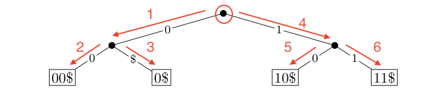

# Trie-tex

A program to generate the LaTex for a given trie.


## Overview

Representing tries in LaTex is a pain. This program outputs the LaTex (as a `tikzpicture` element) for the given trie to a file in the current working directory.

* Command line interface
* Uses the `tikz` package for LaTex (see [styling](#styling) for more)
* Supports uncompressed tries
* Supports `$` as valid character in alphabet
* Works for alphabets of any size (the larger the alphabet, the longer outputting the latex will take)

## Getting started

1. Clone the repo

```bash
$ git clone https://github.com/s278gupt/trie-tex.git
```

2. `cd` into the repo directory and run `make`

```bash
$ cd trie-tex/
$ make
```

3. Run `./triex` with your [input](#command-line-input). The LaTex is outputted to a file with filename specified in your input.

```bash
$ ./triex < input
```

4. Copy the contents from the outputted file into your LaTex document.

**Note**: You must include the following dependency and setup to your LaTex document for the trie to be formatted correctly. See [styling](#styling) for more.

```
\usepackage{tikz}

\tikzset{
    subtree/.style={
        isosceles triangle,
        shape border rotate=90,
        anchor=apex,
        minimum width=25pt
    },
    to subtree/.style={
        edge from parent path={(\tikzparentnode) -- (\tikzchildnode.north)}
    },
    solid node/.style={ circle,draw,inner sep=1.5,fill=black },
    leaf node/.style={ rectangle,draw,inner sep=1.5,fill=white },
    internal node/.style={
        inner sep=1pt,draw,circle,fill=black!15,minimum size=12pt,
    },
}
```

## Command line input

The program expects the following two inputs:

1. `filename`: The filename of the file in the current working directory where the LaTex will be outputted. The default filename is `trie_tex.txt`. If the file does not exist, it is created. Otherwise it is overwritten.

2. The trie representation: the program expects a subtrie to inputted from root to leftmost child until rightmost child. The trie representation has the following components:

    * `root X`: the input must begin with the `root` command, followed by its number of children. The `root`'s number of children cannot be 0.
    * `edge A X`: the `edge` command represents an edge from the parent node with label `A` and `X` children. An `edge` must have a label and cannot have 0 children (otherwise, it is a `leaf`).
    * `leaf A B`: the `leaf` command represents a leaf with edge with label `A` and value `B`. The `leaf` must have both an edge label and a value.

For example, the following input correctly represents the trie in `Figure 1`:

```bash
$ root 2
$ edge 0 2
$ leaf 0 00$
$ leaf $ 0$
$ edge 1 2
$ leaf 0 10$
$ leaf 1 11$
```

The arrows show the order of representation:



**Figure 1:** Simple trie example

See a full example [here](example/); when the program is run with `input.txt`, it outputs `output.txt`. `mytexdoc.tex` is the full LaTex document in which the contents of `output.txt` are copied into and the trie is styled.


## Styling

* If your trie's height is large, you may need to space out the nodes in each level, like so:

```html
\begin{tikzpicture}[
    scale=0.6,font=\footnotesize,
    triee/.style={draw=none,fill=white,inner sep=1pt,font=\scriptsize},
<!-- ADD THE LINES BELOW -->
    <!-- `level distance` represents vertical distance between level 1 and 0 -->
    <!-- `sibling distance` represents distance between nodes on level 1 -->
    level 1/.style={level distance=13mm,sibling distance=90mm},
<!-- ADD THE LINES ABOVE -->
]
```

* If your trie is wide, you may need to change the orientation of your document to `landscape`.


## In progress
- [ ] LaTex formatting (tabs and level spacing)
- [ ] Support for compressed tries

